# AI Impact on Jobs: Salary, Productivity & Employment Analysis

## 📌 Project Overview

This project analyzes how Artificial Intelligence (AI) is transforming jobs, salaries, productivity, and workforce dynamics across industries.

The project combines:

* **Python (Google Colab)** for data cleaning, feature engineering, and exploratory data analysis
* **MySQL** for database creation and SQL integration
* **Power BI** for interactive dashboarding and business storytelling

The analysis focuses on:

* AI adoption levels
* Salary impact before and after AI
* Productivity improvement
* Automation risk
* Job modification vs replacement
* Upskilling requirements
* Workforce transformation patterns

---

# 🛠️ Tech Stack

| Tool                 | Purpose              |
| -------------------- | -------------------- |
| Python               | Data Cleaning & EDA  |
| Pandas & NumPy       | Data Manipulation    |
| Matplotlib & Seaborn | Visualization        |
| MySQL                | Database Storage     |
| Power BI             | Dashboarding         |
| Google Colab         | Notebook Environment |

---

# 📂 End-to-End Project Workflow

```text
Dataset → Python Cleaning & EDA → Feature Engineering → MySQL Database → Power BI Connection → DAX Measures → Dashboard Development
```

---

# 🔹 Step 1: Data Cleaning & Analysis in Python (Google Colab)

The raw dataset was imported into Google Colab for cleaning, preprocessing, feature engineering, and exploratory data analysis.

## ✔ Tasks Performed

* Data inspection using `.info()` and `.describe()`
* Data cleaning and validation
* Feature engineering
* Visualization using Seaborn & Matplotlib
* Business insight generation

---

## 📸 Python Notebook & EDA

### Dataset Exploration

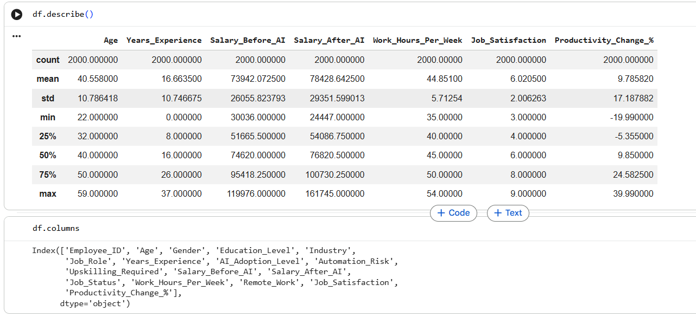


---

## 🔹 Additional Columns Created

The following analytical columns were created:

```python
salary_change
salary_change_pct
salary_change_bin
Years_Experience_bin
```
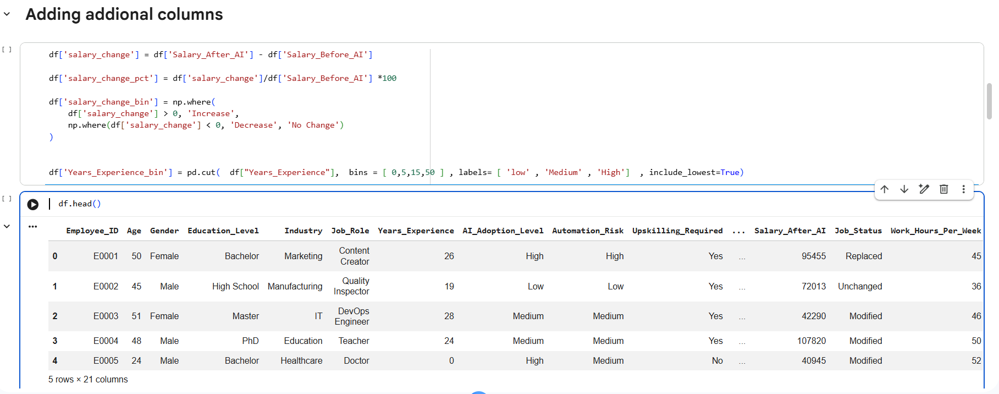


These helped analyze:

* Salary increase/decrease patterns
* Employee experience segmentation
* AI impact categories

---

## 📊 Python Visualizations

### Job Status Distribution

* Majority of jobs remain unchanged
* Large portion of jobs are modified
* Very few jobs are replaced

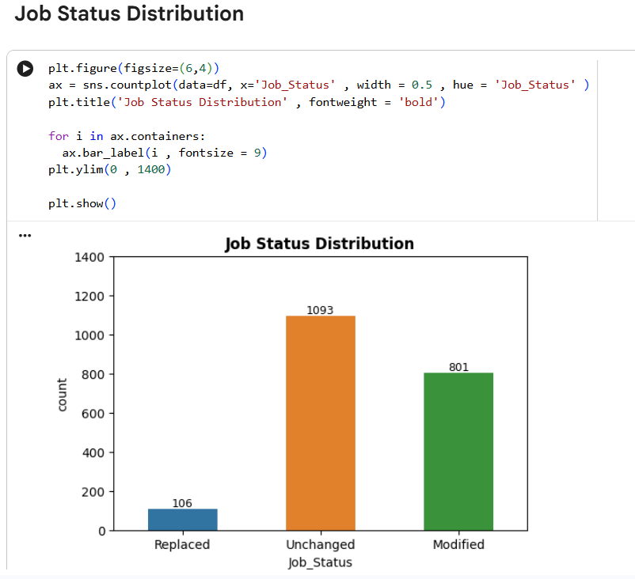

---

### Average Salary Change by Job Status

* Replaced jobs showed highest salary growth
* Modified roles also showed strong growth
* Unchanged jobs had the lowest salary improvement

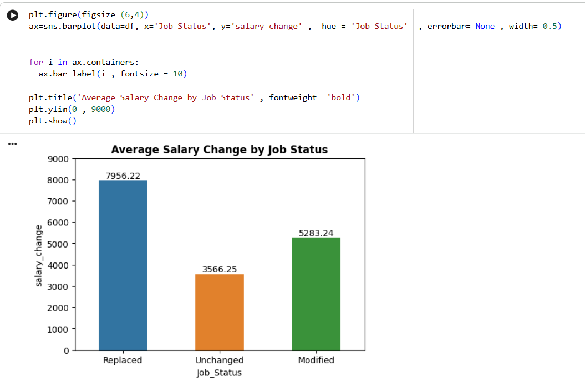

---

### AI Adoption vs Productivity

* High AI adoption resulted in highest productivity growth
* Medium adoption also showed strong improvement
* Low adoption had the weakest productivity gain


---

### Salary Distribution Before vs After AI

The salary distribution shifted upward after AI adoption.

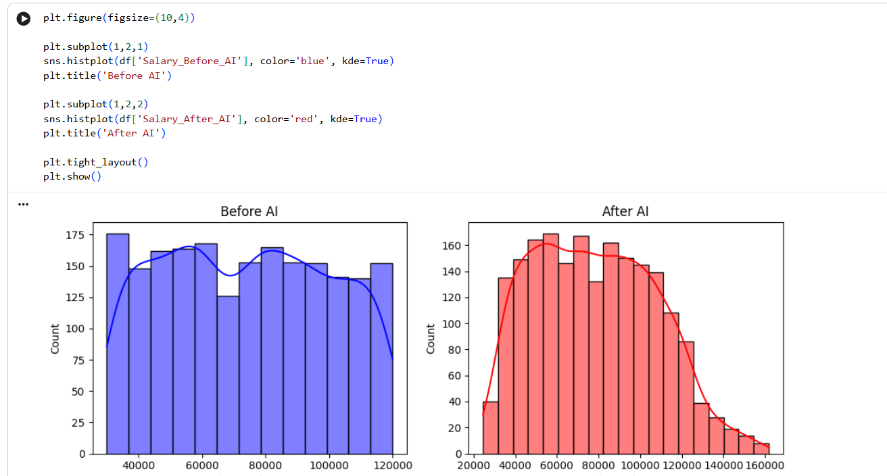

---

# 🔹 Step 2: MySQL Database Creation

After completing the Python analysis, the cleaned dataset was loaded into MySQL.

## ✔ SQL Workflow

* Created database and table
* Defined schema using SQL
* Inserted cleaned records
* Validated records using SQL queries
* Connected MySQL database to Power BI

---

# 📸 MySQL Table Creation

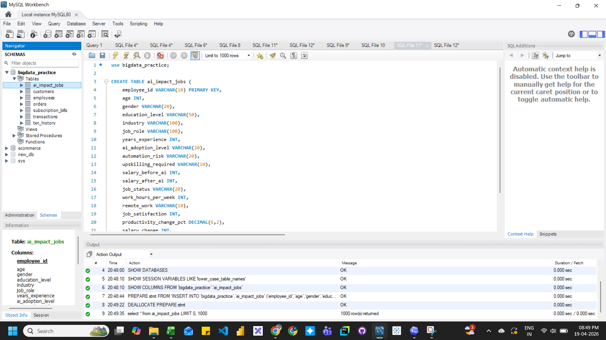

---

# 📸 MySQL Data Validation

Validated imported records directly inside MySQL Workbench.

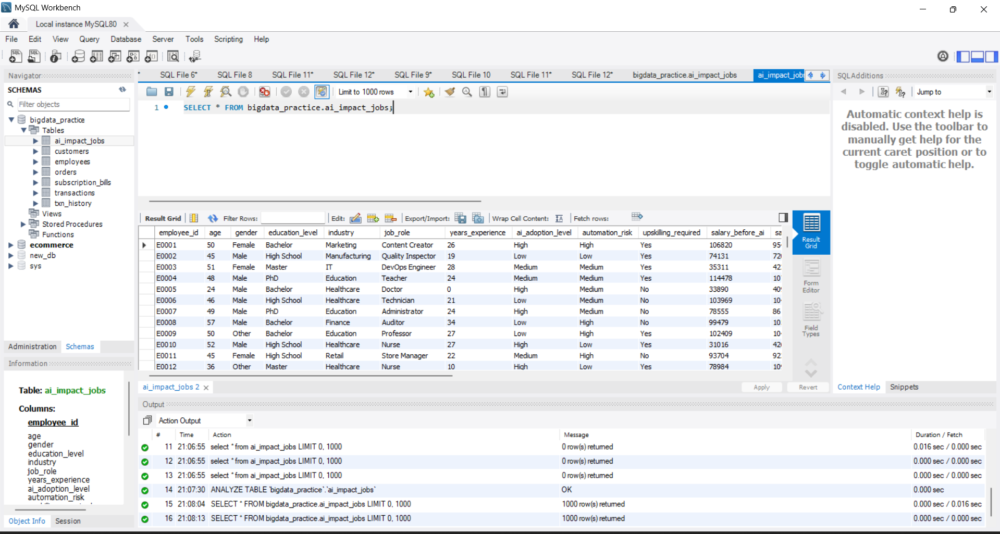

---

# 🔹 Step 3: Power BI Data Loading

The MySQL database was connected directly to Power BI using the MySQL connector.

## ✔ Power BI Integration Steps

1. Connected MySQL database
2. Loaded transformed dataset
3. Created custom DAX measures
4. Built interactive dashboards

---

# 📸 Power BI MySQL Connection

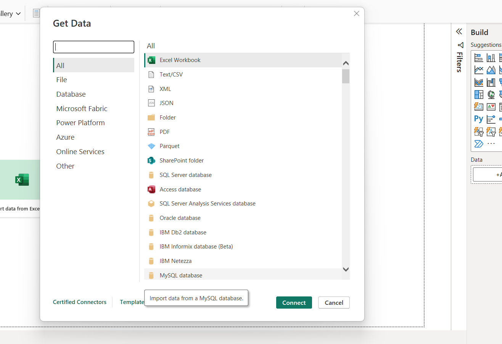

---

# 📸 Power BI Data Loading Navigator

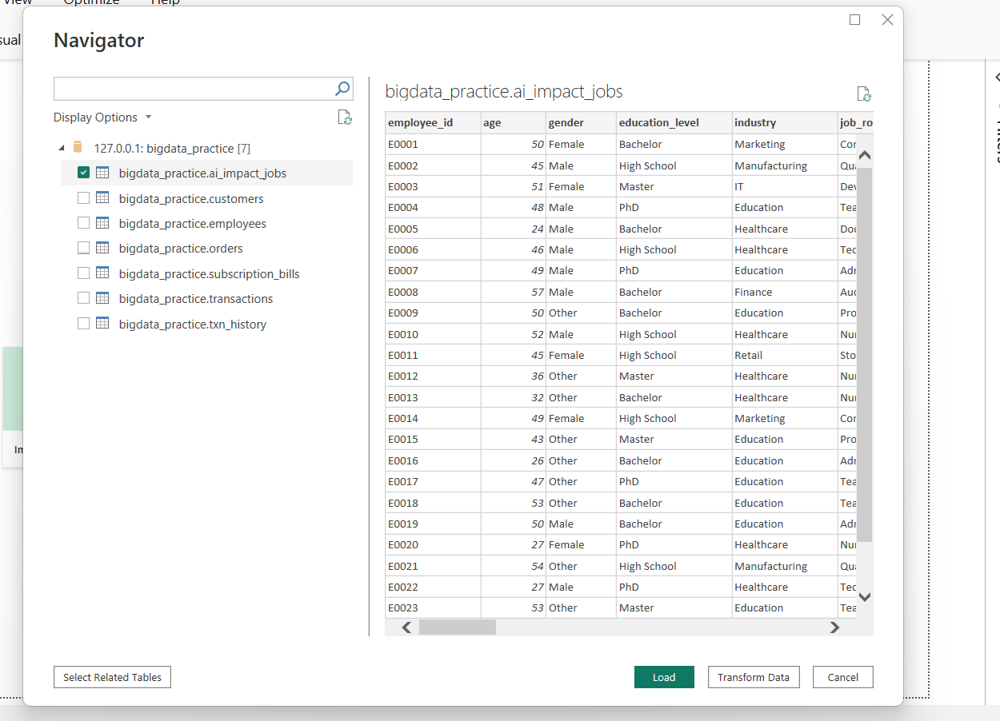

---

# 🔹 Custom DAX Measures Created

Several custom measures were created in Power BI using DAX.

## 📌 Example DAX Measures

### Total Employees

```DAX
Total Employees = COUNT(employee_id)
```

---

### Avg Salary Change %

```DAX
Avg Salary Change % = AVERAGE(salary_change_pct)
```

---

### Avg Productivity Change %

```DAX
Avg Productivity Change % = AVERAGE(productivity_change_pct)
```

---

### High Automation Risk %

```DAX
High Automation Risk % =
DIVIDE(
    CALCULATE(
        COUNTROWS(ai_impact_jobs),
        ai_impact_jobs[automation_risk] = "High"
    ),
    COUNTROWS(ai_impact_jobs)
)
```

---

### Remote Work %

```DAX
Remote Work % =
DIVIDE(
    CALCULATE(
        COUNTROWS(ai_impact_jobs),
        ai_impact_jobs[remote_work] = "Yes"
    ),
    COUNTROWS(ai_impact_jobs)
)
```

---

### Upskill Required %

```DAX
Upskill Required % =
DIVIDE(
    CALCULATE(
        COUNTROWS(ai_impact_jobs),
        ai_impact_jobs[upskilling_required] = "Yes"
    ),
    COUNTROWS(ai_impact_jobs)
)
```

---

# 📊 Power BI Dashboard 1 — AI Workforce Overview

## Focus Areas

* Employee count
* Salary growth
* Productivity improvement
* Automation risk
* Job status analysis
* Industry comparison

---

## 📸 Dashboard 1

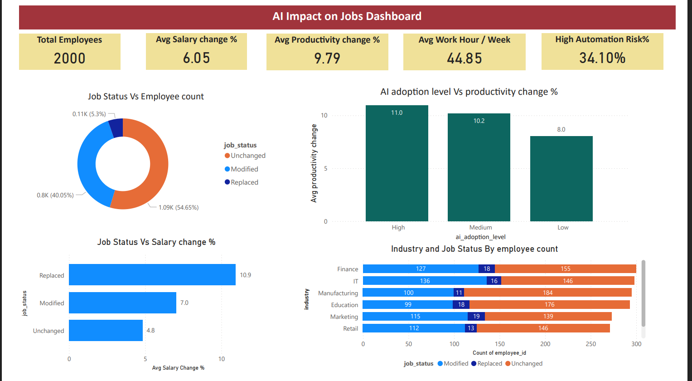

---

## 📌 Key Insights

### ✅ AI Augments More Jobs Than It Replaces

Only a small percentage of jobs were fully replaced.

### ✅ Higher AI Adoption Improves Productivity

Employees with high AI adoption achieved the highest productivity gains.

### ✅ Salary Growth Increases with AI Adoption

Salary growth strongly correlates with productivity improvements.

### ✅ Industry-Wise Workforce Transformation

Different industries experience different automation risk levels.

---

# 📊 Power BI Dashboard 2 — Workforce Transformation & Salary Impact

## Focus Areas

* Salary before vs after AI
* Upskilling impact
* Remote work adoption
* AI adoption impact on productivity
* Industry salary trends

---

## 📸 Dashboard 2

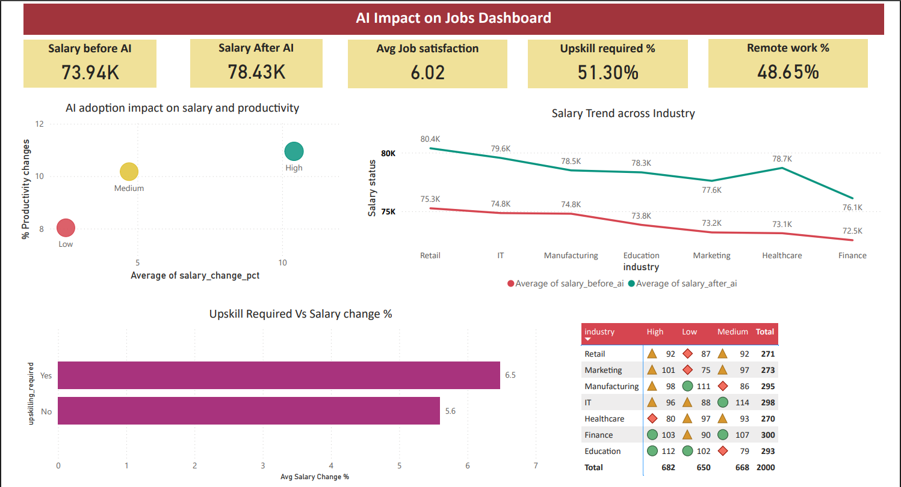

---

## 📌 Key Insights

### ✅ Upskilling Improves Salary Outcomes

Employees requiring upskilling showed stronger salary improvement.

### ✅ AI Adoption Drives Productivity

Higher AI adoption levels consistently improved productivity.

### ✅ Salary Growth Visible Across Industries

Most industries experienced higher post-AI salaries.

### ✅ Workforce Transformation is Already Underway

AI is reshaping jobs more through modification than replacement.

---

# 🎯 Overall Business Insights

## 🔹 AI is Primarily an Augmentation Tool

Most jobs are modified rather than replaced.

## 🔹 Productivity and Salary Growth Move Together

Higher AI adoption leads to better business outcomes.

## 🔹 Upskilling is Critical

Employees who adapt to AI benefit more financially.

## 🔹 Industry-Level Impact Differs

Automation risk varies significantly across industries.

---

# 📁 Project Files

| File                  | Description                     |
| --------------------- | ------------------------------- |
| Python Notebook       | Data cleaning & EDA             |
| SQL Scripts           | Database creation & queries     |
| PBIX Dashboard        | Interactive Power BI dashboards |
| Dashboard Screenshots | Visual outputs                  |
| CSV Dataset           | Cleaned data                    |

---

# 🚀 Future Improvements

* Build predictive machine learning models
* Add employee risk scoring
* Create advanced tooltip pages in Power BI
* Publish dashboards using Power BI Service

---

# 👨‍💻 Author

Rahul Pandey

Aspiring Data Analyst | Python | SQL | Power BI | Data Visualization
